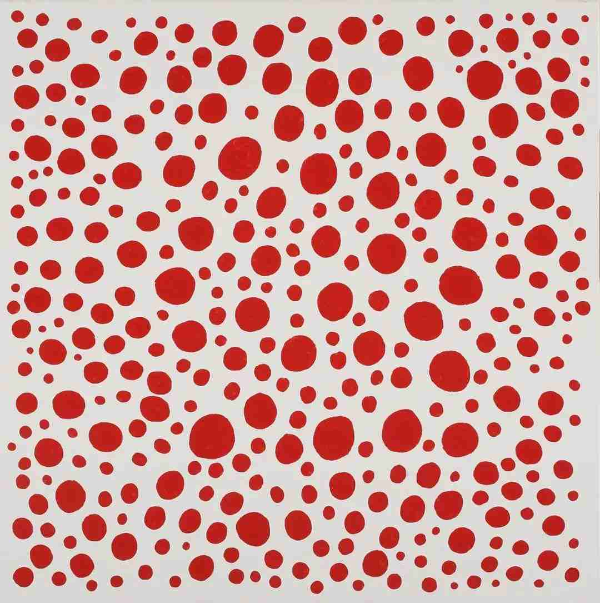

# shyu0865_quiz_8


**My week 8 quiz**

```
Part 1: Imaging Technique Inspiration
```

**The Wheels of fortune**


The painting above is the masterpiece we aim to recreate. In this quiz, my focus lies on its circular elements, which remind me of the works by Yayoi Kusama. Here is the image of her works:

**Infinity Mirrored Room**


I noticed that the circles in this painting have certain gaps between them, they do not overlap, and they fill the entire screen. Therefore, I chose the technique capable of generating these non-overlapping circles as the inspiration for my project, and I plan to consider incorporating this technique into future assignments.


```
Part 2: Coding Technique Exploration
```

In order to generate circles that fill the entire screen and do not overlap, I found the following piece of code. It checks newly generated circles are checked for overlap with existing circles by comparing the distance between their centers and the sum of their radii. If overlap occurs, they cease to grow. Only when a new circle does not overlap with any existing circles is it added to the array. Areas for improvement for the final project include generating circles of equal size, equidistant spacing, and arranged in a systematic pattern.

**Circle packing**


**Code link**
https://happycoding.io/tutorials/p5js/creating-classes/circle-packing
